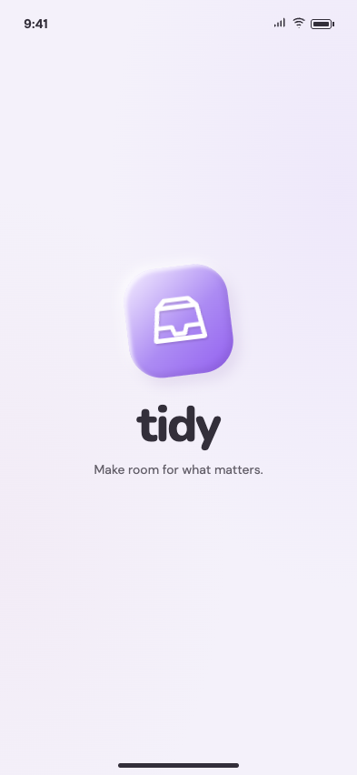
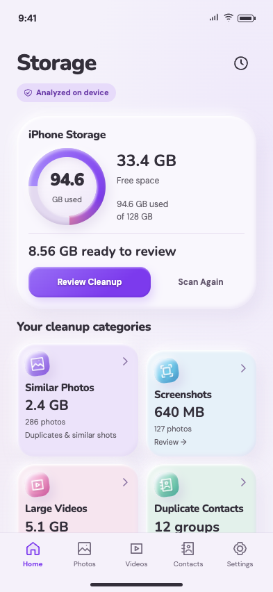
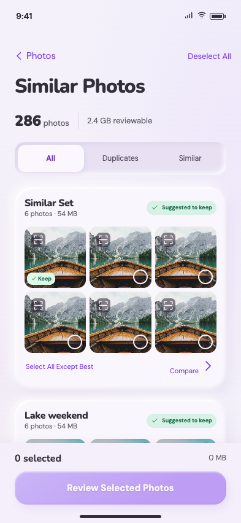

# Tidy

Tidy is an iPhone storage utility for finding, reviewing, and cleaning similar photos, screenshots, large videos, and possible duplicate contacts. Optional tools include possibly blurry photo review, swipe review, video compression, a local Private Vault, Calendar Cleanup, Home Screen widgets, and local cleanup history.

Tidy keeps personal processing on the device. It has no account system, remote backend, upload flow, or app-managed cloud sync. Nothing is removed because it was discovered or recommended: **discovered is not selected, and selected is not deleted.** Cleanup and other destructive operations require an explicit review and confirmation.

This repository contains a Flutter application with production native integrations for iOS. The other Flutter platform folders are also present as project scaffolding; they do not provide parity with the iOS services.

## Screenshots

The images below are **approved design exports**, not captures of the built app. They illustrate the intended visual direction and may show prototype-only content. The complete 73-frame set is in [`Design/exports/screens/`](Design/exports/screens/).

### Splash design reference



### Home design reference



### Similar Photos design reference



### Add runtime screenshots or photos

No verified runtime screenshots are currently included. To add one, create `README-assets/screenshots/` at the repository root, place a PNG or JPG capture there, and commit the image. Then embed it with a repository-relative Markdown path, for example:

```md

```

For an additional product or setup photo, use `README-assets/photos/` and a path such as:

```md

```

Use images you have permission to share. Do not present design exports, synthetic prototype content, or simulator fixtures as real user-library results.

## What the app does

The main app navigation contains Home, Photos, Videos, Contacts, and Settings. The flow is designed around explicit user decisions:

1. Scan device data that iOS makes accessible.
2. Review findings and previews.
3. Select specific items or records.
4. Review the exact operation scope and any available size estimate.
5. Confirm before deletion, merge, or other destructive work.
6. Show the verified outcome and let the user revisit items that did not complete.

### Current feature areas

| Area | Purpose | Main implementation |
| --- | --- | --- |
| Onboarding and access | Explain privacy and permissions, show the splash and welcome flow, request Photos or Contacts access after the user continues, and provide Settings recovery. | `App/lib/features/onboarding/`, `App/ios/Runner/OnboardingNativeService.swift` |
| Scanning and Home | Start, cancel, restore, and reconcile the shared on-device scan; display progress, storage readings, scan freshness, and category findings. | `App/lib/features/scan/`, `App/lib/features/home/`, `App/ios/Runner/LibraryScanService.swift` |
| Photos | Review similar-photo groups and screenshots, compare and preview assets, change keepers, select explicitly, and confirm PhotoKit deletion. Also includes blurry-photo review and swipe selection. | `App/lib/features/photos/`, `App/ios/Runner/PhotoLibraryNativeService.swift`, `App/ios/Runner/PhotoBlurDetector.swift` |
| Videos | Find and sort large videos, show local thumbnails and playback, select videos, and delete the confirmed selection. | `App/lib/features/videos/`, `App/ios/Runner/VideoLibraryNativeService.swift` |
| Contacts | Show possible matches and matching evidence, compare source records, preview and confirm a merge, or separately review contact deletion. | `App/lib/features/contacts/`, `App/ios/Runner/ContactsNativeService.swift` |
| Consolidated cleanup | Combine supported selected items into a final review, allow category edits, confirm, process, and show success or remaining items. | `App/lib/features/cleanup/` |
| Settings | Manage access, scan preferences, similarity sensitivity, privacy information, cleaning guidance, and app version. | `App/lib/features/settings/`, `App/ios/Runner/SettingsNativeService.swift` |
| Optional tools | Review calendar occurrences, compress videos into a separate copy, manage protected vault copies, view local history, and update storage widgets. | `App/lib/features/bonus/`, `App/ios/Runner/GroupEightNativeService.swift`, `App/ios/TidyWidgets/` |

This table describes code present in the repository. Readiness of native workflows still depends on testing against real devices, permissions, and user-owned libraries; the implementation architecture and focused tests are the detailed engineering records.

The optional-tool implementations have distinct scopes:

- **Possibly Blurry and Swipe Clean** are photo review and selection helpers. A swipe decision does not itself delete a photo.
- **Video Compression** exports and verifies a separate playable copy, supports preview and keep-both, and requires a separate reviewed action before offering removal of the original.
- **Private Vault** authenticates with device owner authentication, encrypts imported local copies with CryptoKit AES-GCM, and keeps vault selection/removal separate from Photos cleanup. Import does not delete the Photos original.
- **Calendar Cleanup** lists old and repeated event occurrences within its rolling four-year range and scopes removal to reviewed occurrences.
- **Home Screen Widgets** include small and medium storage summaries, read from the shared App Group and link back to Tidy.
- **Cleanup History** reads local successful-operation records; it does not invent a prior cleanup when history is empty.

## Technology and architecture

- **Flutter and Dart** provide the application UI. The Dart SDK constraint is `^3.12.2` in `App/pubspec.yaml`.
- **Riverpod** (`flutter_riverpod ^3.4.3`) owns app state and dependency wiring.
- **go_router** (`^18.0.1`) owns onboarding, nested tab navigation, and feature routes.
- **Swift and Apple frameworks** provide device-only integrations through named Flutter method channels. Services use PhotoKit, Contacts, EventKit, Vision, AVFoundation/AVKit, LocalAuthentication, CryptoKit, Security, and WidgetKit where relevant.
- **Nunito and DM Sans** are bundled under `App/assets/fonts/`, with their OFL license files.

`App/lib/main.dart` is the app entry point. `App/lib/app.dart` configures the theme and `MaterialApp.router`. `App/lib/core/design/` holds the theme and visual tokens; `App/lib/core/router/app_router.dart` defines navigation; `App/lib/core/widgets/` contains shared UI such as the navigation shell and clay surfaces.

Feature modules follow `presentation/pages`, `widgets`, `controllers`, `models`, `repositories`, and `services` as needed. Controllers coordinate state, repositories present feature-level operations, and services wrap native/device access. Screens compose feature widgets rather than owning PhotoKit, Contacts, EventKit, or filesystem work.

The scan is shared across Home and review features. The native scanner persists lightweight findings in Application Support and reconciles changes from PhotoKit and Contacts notifications. It does not persist photo/video bytes or contact records in that scan snapshot. Selections and in-progress operation queues are not persisted as scan authority.

## Repository and folder guide

The directory tree below was generated from the parent paths of all tracked files (`git ls-files`). It contains **all 156 repository-owned directories** present in the tracked tree; repository root is not included in that count. Git tracks files rather than empty directories, and this scan found no tracked empty directories. The comments describe each directory's role. Generated build output, caches, dependency directories, and DerivedData are listed separately below.

```text
Tidy/
├── .DS_Store                         # Tracked Finder metadata file at repository root
├── AGENTS.md                         # Repository implementation rules
├── ARCHITECTURE.md                   # Feature architecture and native data-flow notes
├── PRD.md                            # Product scope and safety requirements
├── README.md                         # This repository guide
├── App/                              # Flutter application root; pubspec.yaml and pubspec.lock live here
│   ├── android/                      # Android Flutter scaffold; not feature-parity production target
│   │   ├── app/                      # Android app Gradle configuration
│   │   │   └── src/                  # Android build-variant source and resources
│   │   │       ├── debug/            # Debug AndroidManifest.xml
│   │   │       ├── main/             # Main manifest, MainActivity, drawable and launcher resources
│   │   │       │   ├── kotlin/       # Kotlin source namespace for com.example.tidy.MainActivity
│   │   │       │   │   └── com/
│   │   │       │   │       └── example/
│   │   │       │   │           └── tidy/ # MainActivity.kt
│   │   │       │   └── res/             # Android drawable, launcher, and theme resources
│   │   │       │       ├── drawable/
│   │   │       │       ├── drawable-v21/
│   │   │       │       ├── mipmap-hdpi/
│   │   │       │       ├── mipmap-mdpi/
│   │   │       │       ├── mipmap-xhdpi/
│   │   │       │       ├── mipmap-xxhdpi/
│   │   │       │       ├── mipmap-xxxhdpi/
│   │   │       │       ├── values/
│   │   │       │       └── values-night/
│   │   │       └── profile/          # Profile AndroidManifest.xml
│   │   ├── gradle/                   # Android Gradle wrapper configuration
│   │   │   └── wrapper/              # gradle-wrapper.properties
│   ├── assets/                       # Flutter-bundled app assets
│   │   ├── fonts/                    # Nunito and DM Sans TTF files and OFL license texts
│   │   └── icon/                     # 1024 px Tidy source icon PNG
│   ├── ios/                          # iOS app project and native integrations
│   │   ├── Flutter/                  # Flutter framework metadata and Debug/Release xcconfigs
│   │   ├── Runner/                   # iOS app target and native Swift services
│   │   │   ├── Assets.xcassets/      # iOS app icon and launch image asset catalogs
│   │   │   │   ├── AppIcon.appiconset/ # App icon renditions and Contents.json
│   │   │   │   └── LaunchImage.imageset/ # Launch image renditions, Contents.json, asset README
│   │   │   └── Base.lproj/           # Main.storyboard and LaunchScreen.storyboard
│   │   ├── Runner.xcodeproj/         # Runner app, test, and widget target project configuration
│   │   │   ├── project.xcworkspace/  # Xcode project workspace metadata
│   │   │   │   └── xcshareddata/     # Shared Xcode workspace checks/settings
│   │   │   └── xcshareddata/         # Project-shared data
│   │   │       └── xcschemes/        # Shared Runner.xcscheme (build, run, test, archive)
│   │   ├── Runner.xcworkspace/       # Workspace opened for iOS development in Xcode
│   │   │   └── xcshareddata/         # Workspace checks and shared workspace settings
│   │   ├── RunnerTests/              # iOS XCTest tests for native onboarding/calendar/vault helpers
│   │   └── TidyWidgets/              # WidgetKit source, extension Info.plist and entitlements
│   ├── lib/                          # Production Flutter/Dart source
│   │   ├── core/                     # Shared app foundation
│   │   │   ├── design/               # Theme, colors, motion, radii, shadows, sizes, spacing
│   │   │   ├── router/               # app_router.dart and route definitions
│   │   │   └── widgets/              # App-wide navigation, surfaces, buttons, and safety UI
│   │   └── features/                 # Feature-first UI, state, models, repositories, services
│   │       ├── bonus/                # Optional tools; models, services, page and widget code
│   │       │   ├── models/           # Calendar/history/vault value types
│   │       │   ├── presentation/    # Optional-tool screens and presentation-only widgets
│   │       │   │   ├── pages/        # Calendar, history, vault, compression, widget setup screens
│   │       │   │   └── widgets/      # Compression preview presentation
│   │       │   ├── services/        # GroupEightService Flutter method-channel client
│   │       │   └── widgets/          # Shared bonus frame and vault confirmation sheet
│   │       ├── cleanup/              # Consolidated cross-category cleanup flow
│   │       │   ├── controllers/      # CleanupController and cleanup providers
│   │       │   ├── models/           # Frozen cleanup plan and entries
│   │       │   ├── presentation/    # Cleanup screens
│   │       │   │   └── pages/        # Review, progress, result, remaining-item pages
│   │       │   └── widgets/          # Category rows, confirmation and outcome states
│   │       ├── contacts/             # Contact match, merge, and separate deletion flows
│   │       │   ├── controllers/      # Contact selection and operation state
│   │       │   ├── models/           # ContactRecord and contact value types
│   │       │   ├── presentation/    # Contact review screens
│   │       │   │   └── pages/        # Contact, merge, success, and delete-review pages
│   │       │   ├── repositories/    # ContactsRepository
│   │       │   ├── services/        # ContactsService method-channel client
│   │       │   └── widgets/          # Match evidence, contact cards, review rows, confirmations
│   │       ├── home/                 # Main storage overview
│   │       │   ├── presentation/    # Home route and screen composition
│   │       │   │   └── pages/        # HomePage
│   │       │   └── widgets/          # Storage card, scan banners, categories, access and empty states
│   │       ├── onboarding/           # First-run splash, welcome, privacy, permission flows
│   │       │   ├── controllers/      # OnboardingController and authorization workflow
│   │       │   ├── models/           # AccessStatus and PermissionSubject
│   │       │   ├── presentation/    # Onboarding screens
│   │       │   │   └── pages/        # Splash, welcome, privacy, access and handoff pages
│   │       │   ├── repositories/    # OnboardingRepository
│   │       │   ├── services/        # OnboardingService method-channel client
│   │       │   └── widgets/          # Onboarding frame, actions, messages, illustrations
│   │       ├── photos/               # Similar photos, screenshots, blur and swipe review
│   │       │   ├── controllers/      # PhotoSelectionController
│   │       │   ├── models/           # PhotoFormat and PhotoGroup types
│   │       │   ├── presentation/    # Photo review and preview screens
│   │       │   │   └── pages/        # Overview, collection, comparison, viewer, selection, swipe
│   │       │   ├── repositories/    # PhotoGroupRepository
│   │       │   ├── services/        # PhotoLibraryService method-channel client
│   │       │   └── widgets/          # Photo cards, previews, selection, filters, states
│   │       ├── scan/                 # Shared device-library scan and recovery
│   │       │   ├── controllers/      # ScanController and Home snapshot provider
│   │       │   ├── models/           # ScanState and ScanSnapshot
│   │       │   ├── presentation/    # Scan and interrupted-scan screens
│   │       │   │   └── pages/
│   │       │   ├── repositories/    # ScanRepository
│   │       │   ├── services/        # LibraryScanService method-channel client
│   │       │   └── widgets/          # Progress ring, stages, interrupted recovery
│   │       ├── settings/             # Permissions, scan options, privacy, about
│   │       │   ├── controllers/      # SettingsController
│   │       │   ├── models/           # Preferences and display labels
│   │       │   ├── presentation/    # Settings screens
│   │       │   │   └── pages/        # Settings home, access, preferences, privacy, about
│   │       │   ├── repositories/    # SettingsRepository
│   │       │   ├── services/        # SettingsService method-channel client
│   │       │   └── widgets/          # Settings rows, sections, cards, controls
│   │       └── videos/               # Large-video discovery, playback and cleanup
│   │           ├── controllers/      # VideosController
│   │           ├── models/           # VideoRecord
│   │           ├── presentation/    # Videos list and viewer screens
│   │           │   └── pages/
│   │           ├── repositories/    # VideoRepository
│   │           ├── services/        # VideoLibraryService method-channel client
│   │           └── widgets/          # Video cards, sorting, detail and selection controls
│   ├── linux/                        # Flutter Linux desktop scaffold, not iOS feature parity
│   │   ├── flutter/                  # Generated Flutter CMake/plugin integration sources
│   │   └── runner/                   # Linux desktop application entry and GTK window
│   ├── macos/                       # Flutter macOS scaffold; no matching iOS device services
│   │   ├── Flutter/                  # Flutter xcconfigs and plugin registrant
│   │   ├── Runner/                   # macOS app delegate, window, resources and configs
│   │   │   ├── Assets.xcassets/      # macOS application icon catalog
│   │   │   │   └── AppIcon.appiconset/ # macOS app icon renditions and Contents.json
│   │   │   ├── Base.lproj/           # MainMenu.xib
│   │   │   └── Configs/              # AppInfo, Debug, Release, and warning xcconfigs
│   │   ├── Runner.xcodeproj/         # macOS Runner project and shared scheme
│   │   │   ├── project.xcworkspace/  # Xcode project workspace metadata
│   │   │   │   └── xcshareddata/     # Project workspace checks
│   │   │   └── xcshareddata/         # Project-shared data
│   │   │       └── xcschemes/        # Runner macOS scheme
│   │   ├── Runner.xcworkspace/       # macOS workspace metadata
│   │   │   └── xcshareddata/         # Workspace checks/settings
│   │   └── RunnerTests/              # Flutter template XCTest target
│   ├── test/                         # Flutter unit and widget tests
│   │   ├── features/                 # Feature-oriented test suites
│   │   │   ├── bonus/                # Calendar, compression-preview, and Group 8 navigation tests
│   │   │   ├── cleanup/              # Consolidated cleanup flow tests
│   │   │   ├── contacts/             # Repository, controller, merge, and delete review tests
│   │   │   ├── photos/               # Selection, navigation, collection, and confirmation tests
│   │   │   ├── scan/                 # Scan controller and repository tests
│   │   │   ├── settings/             # Settings controller tests
│   │   │   └── videos/               # Video service/review/selection widget tests
│   │   └── support/                  # Fake onboarding service and test support
│   ├── web/                          # Flutter web scaffold; not native PhotoKit app
│   │   └── icons/                    # Web install icons
│   └── windows/                      # Flutter Windows desktop scaffold
│       ├── flutter/                  # Generated Flutter CMake/plugin integration sources
│       └── runner/                   # Win32 runner and resources
│           └── resources/            # Windows application icon
└── Design/                           # Approved interactive design reference, not app runtime source
    ├── .claude/                      # Tracked design-workspace Claude settings
    ├── .codex/                       # Tracked design-workspace Codex hook settings
    ├── .cursor/                      # Tracked design-workspace Cursor hook settings
    ├── .impeccable/                  # Tracked visual-system and review metadata
    │   └── review/                   # Review notes and reference UI captures
    ├── assets/                       # Prototype-only fonts, sample images, licenses and source notes
    └── exports/                      # Approved screen renders and complete-flow board
        └── screens/                  # The 73 individually named frame exports
```

The tree lists every tracked directory, including all nested platform and hidden design-tool folders. There are no repository-tracked empty directories: Git records the files inside these folders. `App/permissions/` is not shown because it has no tracked files and is not a tracked directory.

### Folder-by-folder file index

The tree identifies all 156 directories; this index calls out key files in each folder family. Where a path contains nested folders with the same structural job, each exact path is listed.

| Folder path(s) | Purpose and important files |
| --- | --- |
| Repository root | `.DS_Store` is tracked Finder metadata; `README.md`, `PRD.md`, `ARCHITECTURE.md`, and `AGENTS.md` are project documentation. |
| `App/` | Flutter project root. `pubspec.yaml` declares SDK/dependencies/fonts/version; `pubspec.lock` pins Dart packages; `.metadata`, `.gitignore`, `analysis_options.yaml`, and `README.md` support Flutter tooling and app docs. |
| `App/android/`, `App/android/app/`, `App/android/app/src/` | Android scaffold/configuration. Important files: root/app `build.gradle.kts`, `settings.gradle.kts`, `gradle.properties`, and source manifests. `App/android/gradle/wrapper/gradle-wrapper.properties` pins wrapper distribution settings. |
| `App/android/app/src/debug/`, `App/android/app/src/profile/` | Debug and profile variant manifests. |
| `App/android/app/src/main/`, `App/android/app/src/main/kotlin/`, `App/android/app/src/main/kotlin/com/`, `App/android/app/src/main/kotlin/com/example/`, `App/android/app/src/main/kotlin/com/example/tidy/` | Android main manifest and Kotlin namespace; `MainActivity.kt` is the activity entry point. |
| `App/android/app/src/main/res/`, `App/android/app/src/main/res/drawable/`, `App/android/app/src/main/res/drawable-v21/`, `App/android/app/src/main/res/values/`, `App/android/app/src/main/res/values-night/` | Android launch backgrounds and day/night style resources. |
| `App/android/app/src/main/res/mipmap-hdpi/`, `App/android/app/src/main/res/mipmap-mdpi/`, `App/android/app/src/main/res/mipmap-xhdpi/`, `App/android/app/src/main/res/mipmap-xxhdpi/`, `App/android/app/src/main/res/mipmap-xxxhdpi/` | Density-specific Android launcher icons. |
| `App/android/gradle/`, `App/android/gradle/wrapper/` | Gradle wrapper support; wrapper properties are tracked, while local SDK paths and generated Gradle outputs are not source. |
| `App/assets/`, `App/assets/fonts/`, `App/assets/icon/` | App assets. `fonts/` contains six bundled Nunito/DM Sans font files and their OFL licenses; `icon/` contains `tidy_icon_1024.png`. |
| `App/lib/` | Dart production code. `main.dart` starts `ProviderScope`; `app.dart` sets the theme and router. |
| `App/lib/core/`, `core/design/`, `core/router/`, `core/widgets/` | Shared foundations. Design tokens live in `tidy_theme.dart`, `tidy_colors.dart`, `tidy_spacing.dart`, `tidy_sizes.dart`, `tidy_radii.dart`, `tidy_shadows.dart`, and `tidy_motion.dart`; routes are in `app_router.dart`; shared UI includes `tidy_navigation_shell.dart`, `tidy_action_button.dart`, `tidy_clay_surface.dart`, and related widgets. |
| `App/lib/features/` | Root of the feature-first app modules. Each path below is a tracked source folder and has focused feature ownership. |
| `App/lib/features/onboarding/`, `App/lib/features/onboarding/controllers/`, `App/lib/features/onboarding/models/`, `App/lib/features/onboarding/presentation/`, `App/lib/features/onboarding/presentation/pages/`, `App/lib/features/onboarding/repositories/`, `App/lib/features/onboarding/services/`, `App/lib/features/onboarding/widgets/` | Splash, welcome, privacy, Photos/Contacts explanation and request handoff; key files include `onboarding_controller.dart`, `access_status.dart`, `permission_subject.dart`, `splash_page.dart`, `onboarding_repository.dart`, `onboarding_service.dart`, and onboarding components. |
| `App/lib/features/scan/`, `App/lib/features/scan/controllers/`, `App/lib/features/scan/models/`, `App/lib/features/scan/presentation/`, `App/lib/features/scan/presentation/pages/`, `App/lib/features/scan/repositories/`, `App/lib/features/scan/services/`, `App/lib/features/scan/widgets/` | Shared scan lifecycle and UI; key files include `scan_controller.dart`, `scan_snapshot_provider.dart`, `scan_state.dart`, `scan_snapshot.dart`, `scan_page.dart`, `scan_interrupted_page.dart`, `scan_repository.dart`, `library_scan_service.dart`, and progress/recovery widgets. |
| `App/lib/features/home/`, `App/lib/features/home/presentation/`, `App/lib/features/home/presentation/pages/`, `App/lib/features/home/widgets/` | Main storage dashboard and category access; key files include `home_page.dart`, `home_storage_card.dart`, scan/access/category cards, and empty states. |
| `App/lib/features/photos/`, `App/lib/features/photos/controllers/`, `App/lib/features/photos/models/`, `App/lib/features/photos/presentation/`, `App/lib/features/photos/presentation/pages/`, `App/lib/features/photos/repositories/`, `App/lib/features/photos/services/`, `App/lib/features/photos/widgets/` | Similar groups, screenshots, preview, selection/review, blurry and swipe screens. Key files include `photo_selection_controller.dart`, `photo_group.dart`, `photo_group_repository.dart`, `photo_library_service.dart`, `photo_collection_page.dart`, `photo_viewer_page.dart`, and selection/thumbnail/confirmation widgets. |
| `App/lib/features/videos/`, `App/lib/features/videos/controllers/`, `App/lib/features/videos/models/`, `App/lib/features/videos/presentation/`, `App/lib/features/videos/presentation/pages/`, `App/lib/features/videos/repositories/`, `App/lib/features/videos/services/`, `App/lib/features/videos/widgets/` | Large-video discovery, sorting, preview/player and selection; key files include `videos_controller.dart`, `video_record.dart`, `video_repository.dart`, `video_library_service.dart`, `videos_page.dart`, `video_viewer_page.dart`, and playback/review widgets. |
| `App/lib/features/contacts/`, `App/lib/features/contacts/controllers/`, `App/lib/features/contacts/models/`, `App/lib/features/contacts/presentation/`, `App/lib/features/contacts/presentation/pages/`, `App/lib/features/contacts/repositories/`, `App/lib/features/contacts/services/`, `App/lib/features/contacts/widgets/` | Candidate matching, merge review, and separate contact deletion; key files include `contacts_controller.dart`, `contact_record.dart`, `contacts_repository.dart`, `contacts_service.dart`, `contacts_page.dart`, `merged_contact_preview_page.dart`, and match/confirmation widgets. |
| `App/lib/features/cleanup/`, `App/lib/features/cleanup/controllers/`, `App/lib/features/cleanup/models/`, `App/lib/features/cleanup/presentation/`, `App/lib/features/cleanup/presentation/pages/`, `App/lib/features/cleanup/widgets/` | Cross-category final review and processing; key files include `cleanup_controller.dart`, `cleanup_plan.dart`, `cleanup_review_page.dart`, progress/result/remaining pages, and confirmation/outcome widgets. |
| `App/lib/features/settings/`, `App/lib/features/settings/controllers/`, `App/lib/features/settings/models/`, `App/lib/features/settings/presentation/`, `App/lib/features/settings/presentation/pages/`, `App/lib/features/settings/repositories/`, `App/lib/features/settings/services/`, `App/lib/features/settings/widgets/` | Access and scan preferences, sensitivity, privacy/how-it-works/about; key files include `settings_controller.dart`, `scan_preferences.dart`, `settings_repository.dart`, `settings_service.dart`, the settings pages, and section/permission/entry widgets. |
| `App/lib/features/bonus/`, `App/lib/features/bonus/models/`, `App/lib/features/bonus/presentation/`, `App/lib/features/bonus/presentation/pages/`, `App/lib/features/bonus/presentation/widgets/`, `App/lib/features/bonus/services/`, `App/lib/features/bonus/widgets/` | Calendar, compression, vault, widget setup, and history; key files include `bonus_records.dart`, optional-tool page files, `video_compression_preview.dart`, `group_eight_service.dart`, and bonus/vault sheets. |
| `App/test/`, `App/test/features/` | Flutter test root and feature-oriented suites. Root-level tests cover app shell, onboarding, and Group 02 UI. |
| `App/test/features/bonus/`, `App/test/features/cleanup/`, `App/test/features/contacts/`, `App/test/features/photos/`, `App/test/features/scan/`, `App/test/features/settings/`, `App/test/features/videos/` | Focused suites for those features; representative names include `calendar_cleanup_test.dart`, `cleanup_flow_test.dart`, `contacts_controller_test.dart`, `photo_selection_test.dart`, `scan_repository_test.dart`, `settings_controller_test.dart`, and `videos_test.dart`. |
| `App/test/support/` | Test-only doubles and helpers, including `fake_onboarding_service.dart`. No fixtures here are loaded by the production app. |
| `App/ios/`, `App/ios/Flutter/` | Native iOS project and Flutter integration metadata. `Debug.xcconfig`, `Release.xcconfig`, and `AppFrameworkInfo.plist` are tracked. |
| `App/ios/Runner/`, `App/ios/Runner/Assets.xcassets/`, `App/ios/Runner/Assets.xcassets/AppIcon.appiconset/`, `App/ios/Runner/Assets.xcassets/LaunchImage.imageset/`, `App/ios/Runner/Base.lproj/` | iOS app resources. `AppDelegate.swift` registers native integrations; `Info.plist`, `Runner.entitlements`, `PrivacyInfo.xcprivacy`, storyboards, asset `Contents.json` files, app-icon and launch-image PNGs are important. Native service roles are detailed below. |
| `App/ios/Runner.xcodeproj/`, `App/ios/Runner.xcodeproj/project.xcworkspace/`, `App/ios/Runner.xcodeproj/project.xcworkspace/xcshareddata/`, `App/ios/Runner.xcodeproj/xcshareddata/`, `App/ios/Runner.xcodeproj/xcshareddata/xcschemes/` | Xcode project configuration, project-workspace metadata, and the shared `Runner.xcscheme` used for build/run/test/archive. |
| `App/ios/Runner.xcworkspace/`, `App/ios/Runner.xcworkspace/xcshareddata/` | Shared Xcode workspace metadata. Open `Runner.xcworkspace` for the iOS app. The tracked project currently has no Podfile. |
| `App/ios/RunnerTests/` | Native `RunnerTests.swift` XCTest coverage for onboarding persistence and selected native helpers. |
| `App/ios/TidyWidgets/` | Widget extension source and configuration: `TidyWidgets.swift`, `Info.plist`, `TidyWidgets.entitlements`. |
| `App/linux/`, `App/linux/flutter/`, `App/linux/runner/` | Flutter Linux scaffold; generated Flutter CMake/plugin integration and the GTK desktop runner. It does not implement the iOS method channels. |
| `App/macos/`, `App/macos/Flutter/`, `App/macos/Runner/`, `App/macos/Runner/Assets.xcassets/`, `App/macos/Runner/Assets.xcassets/AppIcon.appiconset/`, `App/macos/Runner/Base.lproj/`, `App/macos/Runner/Configs/` | Flutter macOS scaffold, plugin registrant, app delegate/window, icon resources, `MainMenu.xib`, and app/debug/release/warning xcconfigs. |
| `App/macos/Runner.xcodeproj/`, `App/macos/Runner.xcodeproj/project.xcworkspace/`, `App/macos/Runner.xcodeproj/project.xcworkspace/xcshareddata/`, `App/macos/Runner.xcodeproj/xcshareddata/`, `App/macos/Runner.xcodeproj/xcshareddata/xcschemes/` | macOS Xcode project, workspace metadata, and shared scheme. |
| `App/macos/Runner.xcworkspace/`, `App/macos/Runner.xcworkspace/xcshareddata/`, `App/macos/RunnerTests/` | macOS workspace metadata and the current template XCTest target. |
| `App/web/`, `App/web/icons/` | Flutter web scaffold, `index.html`, `manifest.json`, favicon, and install icons; native device cleanup services are iOS-only. |
| `App/windows/`, `App/windows/flutter/`, `App/windows/runner/`, `App/windows/runner/resources/` | Flutter Windows scaffold, generated Flutter CMake integration, Win32 runner, manifest, and app icon resource. |
| `Design/` | Design reference root: `tidy_design.html`, `PRODUCT.md`, `DESIGN.md`, `README.md`, `export-tidy.cjs`, and `verify-tidy.cjs`. This prototype is not the Flutter runtime. |
| `Design/.claude/`, `Design/.codex/`, `Design/.cursor/` | Tracked tool-specific design workspace settings/hook files. These files are not app configuration. |
| `Design/.impeccable/`, `Design/.impeccable/review/` | Design-tool configuration and review artifacts (`design.json`, surface brief, review notes and review captures). |
| `Design/assets/` | Prototype-only imagery, sample photos, font sources/exports, font CSS, licenses, and `SOURCES.md`. These sample photos are not production user data. |
| `Design/exports/`, `Design/exports/screens/` | The complete flow-board PNG/zip and 73 named design-frame PNG exports used by the screenshots section. |

### Native iOS file map

`App/ios/Runner/AppDelegate.swift` registers native channels and the video platform view. The native service files are separated by responsibility:

- `OnboardingNativeService.swift` — Photos/Contacts authorization, limited Photos picker, Settings handoff, and local onboarding-completion marker.
- `LibraryScanService.swift` — PhotoKit and Contacts scan, Vision matching/analysis, progress/cancellation, restore/reconciliation, and local scan snapshot.
- `PhotoLibraryNativeService.swift` — offline photo thumbnails and selected PhotoKit deletion with access and identifier checks.
- `VideoLibraryNativeService.swift` — video thumbnail/details/playback and revalidated deletion.
- `ContactsNativeService.swift` — contact read, merge, and delete operations with version checks.
- `SettingsNativeService.swift` — native-backed scan preferences and app version.
- `GroupEightNativeService.swift` — calendar, compression, vault, widget summary, and local history operations.
- `PhotoBlurDetector.swift` — local photo blur scoring helper.
- `Info.plist`, `Runner.entitlements`, and `PrivacyInfo.xcprivacy` — usage strings, app-group capability, and privacy manifest.
- `Assets.xcassets/` and `Base.lproj/` — app/launch assets and storyboards.

`App/ios/TidyWidgets/TidyWidgets.swift` defines the small and medium storage widgets. Both the app and extension use the App Group `group.com.pinkshoe.tidy` to share the local widget summary. The extension bundle identifier is `com.pinkshoe.tidy.widget`.

## Requirements and configuration

### Development requirements

- macOS with Xcode and an installed iOS SDK.
- Flutter installed with a Dart SDK satisfying `App/pubspec.yaml` (`^3.12.2`).
- Xcode command-line tools available to Flutter. The tracked iOS project uses Flutter's generated Swift Package integration; no `Podfile` is tracked and CocoaPods is not listed as a direct app dependency.
- An iOS 17 or later simulator, or a physical iPhone running a compatible iOS release.
- For a signed device build or TestFlight archive: an Apple Developer account, a team selected in Xcode, and valid signing/provisioning for both the app and widget extension.

### App identifiers and entitlements

The Xcode project currently declares:

| Target | Bundle identifier | iOS deployment target | App Group |
| --- | --- | --- | --- |
| Runner app | `com.pinkshoe.tidy` | iOS 17.0 | `group.com.pinkshoe.tidy` |
| TidyWidgets extension | `com.pinkshoe.tidy.widget` | iOS 17.0 | `group.com.pinkshoe.tidy` |

The Runner test target uses `com.pinkshoe.tidy.RunnerTests`. Signing is configured in the Xcode project; select the correct Apple Developer team in Xcode and verify that the app and widget extension provisioning profiles both enable the shared App Group. Do not commit certificates, private keys, provisioning profile files, or local signing credentials.

The app usage descriptions are in `App/ios/Runner/Info.plist`: Photos, Contacts, Face ID/device authentication, and full Calendar access. `Runner.entitlements` and `TidyWidgets.entitlements` declare the shared App Group. No API key or remote service credential is required by the repository’s current Flutter dependencies.

The direct Dart dependencies are `flutter_riverpod ^3.4.3` and `go_router ^18.0.1`. Test/lint dependencies are Flutter's `flutter_test` SDK package and `flutter_lints ^6.0.0`. Apple system frameworks provide native features; `App/pubspec.lock` pins resolved Dart packages.

## Installation and running

Clone the repository, then work from `App/`:

```sh
git clone <repository-url> Tidy
cd Tidy/App
flutter pub get
```

Replace `<repository-url>` with the clone URL you use.

### iOS Simulator

1. Confirm Xcode and Flutter can see an iOS simulator:

   ```sh
   flutter doctor
   flutter devices
   ```

2. Boot an iOS 17+ simulator in Xcode or Simulator.app.
3. From `App/`, run `flutter run -d <simulator-id>`, replacing `<simulator-id>` with the iOS device ID from `flutter devices`.

The command is:

```sh
cd App
flutter run -d <simulator-id>
```

### Physical iPhone

1. Connect and trust the iPhone, enable Developer Mode if iOS requests it, and unlock the device.
2. Open `App/ios/Runner.xcworkspace` in Xcode (not the `.xcodeproj`).
3. Select the `Runner` scheme and the connected iPhone as the run destination.
4. In **Signing & Capabilities**, select your Apple Developer team for both `Runner` and `TidyWidgets`. Confirm the App Group capability `group.com.pinkshoe.tidy` is enabled for both targets and that the matching provisioning profile includes it.
5. Run the app from Xcode, or use `flutter devices` to obtain the iPhone ID and run:

   ```sh
   cd App
   flutter run -d <iphone-id>
   ```

The first run may require accepting the developer certificate on the device. Real PhotoKit, Contacts, Calendar, authentication, compression, and widget behavior must be exercised on hardware with suitable user-owned content and permissions; simulator permission states do not replace device validation.

## Permissions, scanning, and limitations

### Permission behavior

Permission requests are made by the iOS native services in response to the user continuing through the relevant feature flow. Launching Tidy does not itself start a scan or request Photos/Contacts access.

- **Photos:** PhotoKit read/write authorization reports not determined, granted, limited, denied, or restricted. Limited access is supported. Users can manage their limited selection through the system picker or change access in iOS Settings.
- **Contacts:** access reports not determined, granted, denied, restricted, and limited where the OS exposes it (limited Contacts access on iOS 18+). The app handles access as reported by the current iOS version.
- **Calendar:** access is requested when Calendar Cleanup is opened. iOS 17+ full Calendar access is needed to list events for review; denied, restricted, write-only, or unavailable states are not treated as readable access.
- **Vault:** local device-owner authentication uses Face ID or the device passcode. This is device authentication, not an account or remote identity system.

The app refreshes permission status from iOS when returning to the foreground. Previously discovered data that is no longer accessible is removed from actionable review; permission loss never grants deletion authority.

### Scan behavior

The shared iOS scanner reads accessible photo and video assets using PhotoKit and contact match candidates using Contacts. Vision feature prints support possible visual-similarity groups; a local blur score marks items as **possibly** blurry. These are recommendations, not guarantees of exact duplicates or unwanted content. Similarity settings affect discovery only.

The scan can be started explicitly, reports progress, and can be cancelled. A successful lightweight snapshot is stored under the app's Application Support directory in `TidyScan/completed-v1.json`, protected by iOS file protection and excluded from backups. It stores identifiers and scan metadata, not photo/video bytes or contact records. An interruption marker is used to detect an unfinished scan. Existing successful findings can be restored and reconciled after launch; relaunch does not silently restart a destructive operation.

Photo/video resource reads and previews disallow network access. Cloud-only or unavailable resources therefore remain unavailable until the user makes them local through Apple's own Photos behavior. Tidy does not trigger cloud retrieval. Limited Photos access restricts the scan to the assets iOS exposes. Actual available storage is a device reading; an estimated removable size is not a promise of reclaimed space, and Photos may keep removed items in Recently Deleted.

The contacts service does not fetch Apple's protected Contacts Notes field. Merge review must account for this limitation. Calendar cleanup operates on selected occurrences and does not implicitly remove an entire recurring series. Compression creates a separate copy; removal of the original is a distinct reviewed action. Vault import creates protected app-local copies and leaves the Photos originals in place.

## Build and test

Run Flutter commands from `App/`.

### Static analysis and Flutter tests

```sh
cd App
flutter analyze
flutter test
```

To run an individual suite, pass its repository-relative path, for example:

```sh
cd App
flutter test test/features/cleanup/cleanup_flow_test.dart
```

The Flutter tests cover onboarding and permission transitions, scan restoration/cancellation, photo selection and navigation, video sorting/selection/deletion review, contact matching/merge review, cleanup confirmation, settings, Calendar Cleanup, and optional-feature navigation/preview. `App/test/support/` contains test-only helpers; it is not app data or a production fake-data source.

There are also native XCTest targets at `App/ios/RunnerTests/` and `App/macos/RunnerTests/`. The macOS target currently contains Flutter template coverage. Run iOS native tests from Xcode using the `Runner` scheme and an iOS simulator destination.

### iOS build

An unsigned device build (suitable for checking compilation, not installation or TestFlight submission) can be created with:

```sh
cd App
flutter build ios --release --no-codesign
```

The output is `App/build/ios/iphoneos/Runner.app`. For a signed app or archive, configure signing for both Xcode targets and build/archive through Xcode or a correctly configured Flutter/Xcode release command. The project version and build number come from `version:` in `App/pubspec.yaml` (currently `1.0.0+5`).

## Troubleshooting

| Symptom | Checks |
| --- | --- |
| No iOS device appears | Run `flutter doctor` and `flutter devices`; verify Xcode installation, simulator runtime, cable/trust, and Developer Mode for a physical device. |
| Flutter/Xcode plugin integration errors | From `App/`, run `flutter pub get`, then reopen `ios/Runner.xcworkspace`. Check Flutter and Xcode setup with `flutter doctor`; do not run `pod install` for this repository's tracked project because it has no `Podfile`. |
| Signing or App Group error | Configure the same valid team for `Runner` and `TidyWidgets`. Confirm both bundle IDs and both entitlements include `group.com.pinkshoe.tidy`; verify the provisioning profile has the App Group capability. |
| Permission is denied or restricted | Review the feature's access state and use the in-app Settings action. Restricted access may be controlled by device policy and cannot be overridden by Tidy. |
| A photo or video preview is unavailable | Confirm the asset is accessible under current Photos permission and stored locally. Tidy intentionally does not ask PhotoKit to download cloud-only media. |
| Findings appear stale or incomplete | Check Photos/Contacts access, return to Tidy to allow reconciliation, then use the explicit scan/retry action. A cancelled or interrupted scan does not authorize cleanup. |
| Build number rejected by App Store Connect | Increment the `+build` portion of `App/pubspec.yaml` before producing the next upload. Keep the marketing version and build number aligned across the app and widget through Flutter/Xcode settings. |

## Privacy and local data

Tidy does not send scanned library data to a Tidy server. The scan snapshot contains IDs, metadata, hashes/analysis output, category relationships, access state, and scan time. Contact details are read for review but are not written into that scan snapshot. Settings use local `UserDefaults`. Onboarding completion, scan data, vault copies, widget summary, and history use app-local protected storage or the declared App Group as appropriate.

Private Vault copies are a separate feature with local authentication and protected files. They are not the Photos originals and are not part of cleanup selection. Widgets show a local storage summary and open Tidy; they do not initiate cleanup. iOS Photos, Contacts, or Calendar sync remains under the user's system settings and is not controlled by Tidy.

`App/ios/Runner/PrivacyInfo.xcprivacy` declares no tracking and no collected-data types, and records the disk-space API reason used by the app. Review this manifest whenever native API usage changes.

## Generated and local files

Generated files are excluded from the source tree and should not be added to the architecture diagram. Common examples include:

- `App/.dart_tool/`, `.flutter-plugins-dependencies`, and package caches from Dart/Flutter tooling.
- `App/build/` and `App/coverage/` output.
- Flutter may create `App/ios/Flutter/ephemeral/` while generating its Xcode/Swift Package integration; Xcode creates `DerivedData/` and user-specific workspace state. This repository has no tracked `Podfile` or `Pods/`; if a developer adds a plugin that uses CocoaPods, Flutter/CocoaPods may create ignored `App/ios/Pods/` dependencies after that plugin integration is configured.
- Android `.gradle/`, `.cxx/`, local SDK properties, and build outputs.

These are recreated by Flutter, CocoaPods, Gradle, or Xcode. The repository does track platform project sources and workspace/scheme settings; those are not generated build products.

## Design references

`Design/tidy_design.html` is an interactive HTML/CSS/JavaScript prototype and the visual source of truth. It uses design fixtures and local sample photos; it is not the production Flutter app and its counts are not live device data. `Design/PRODUCT.md`, `Design/DESIGN.md`, `Design/assets/SOURCES.md`, and `Design/exports/` describe the brief, visual system, assets, and approved frame exports. Do not edit those references as part of routine app implementation.

## Further reading

- [Product requirements](PRD.md)
- [Implementation architecture](ARCHITECTURE.md)
- [Repository implementation instructions](AGENTS.md)
- [Design reference index](Design/README.md)
